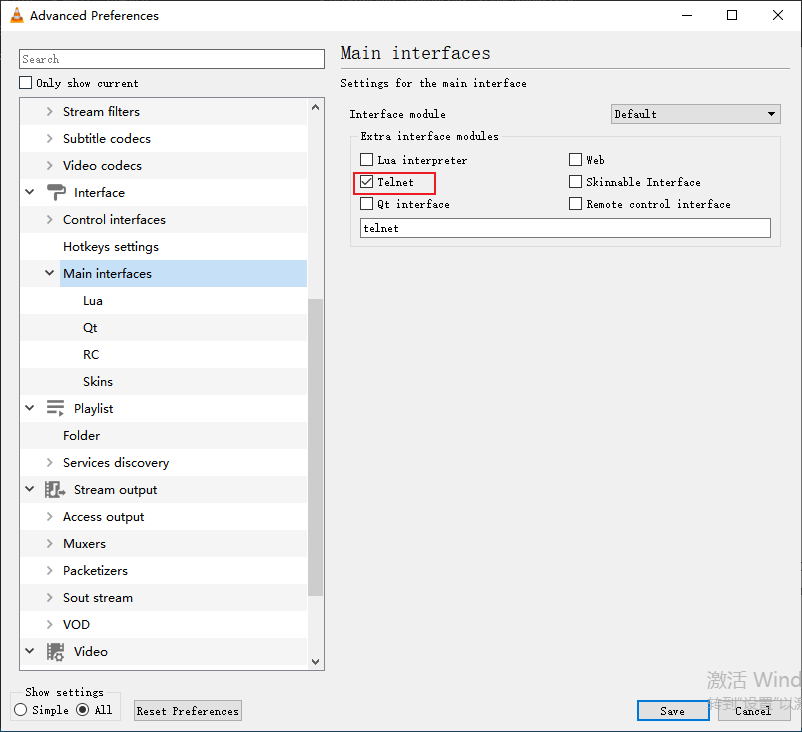

<!-- @import "[TOC]" {cmd="toc" depthFrom=1 depthTo=6 orderedList=false} -->

<!-- code_chunk_output -->

- [1. Introduction](#1-introduction)
- [2. Usage](#2-usage)
  - [2.1. Configuration](#21-configuration)
    - [2.1.1. Config VLC](#211-config-vlc)
    - [2.1.2. Config this app](#212-config-this-app)
  - [2.2. Change subtitle](#22-change-subtitle)
  - [2.3. Shortcut keyboard](#23-shortcut-keyboard)
  - [2.4. Check the subtitle number](#24-check-the-subtitle-number)

<!-- /code_chunk_output -->

# 1. Introduction
This app is to change subtitles in VLC(a famous media player) quickly between Chinese, English, and None subtitle

# 2. Usage
## 2.1. Configuration
### 2.1.1. Config VLC
Tools-Preferences-All

Set the Lua Telnet

Then, open the Lua interface after VLC is started

### 2.1.2. Config this app
Make sure that:
* The configuration `Subtitle Telnet` is the same with VLC (especially the password)
* The subtitle setting. The default setting should be true. 
    * See If you want to change it. 

## 2.2. Change subtitle
You can click the buttons on the main window to change subtitles quickly or press the shortcut keyboards

## 2.3. Shortcut keyboard
|keyboard|function|
|-|-|
|`Z`|Change to English subtitle|
|`X`|Change to Chinese subtitle|
|`C`|Disable all subtitle|

## 2.4. Check the subtitle number
In VLC, View-`Add Interface`-`Console`

Then input `strack`

